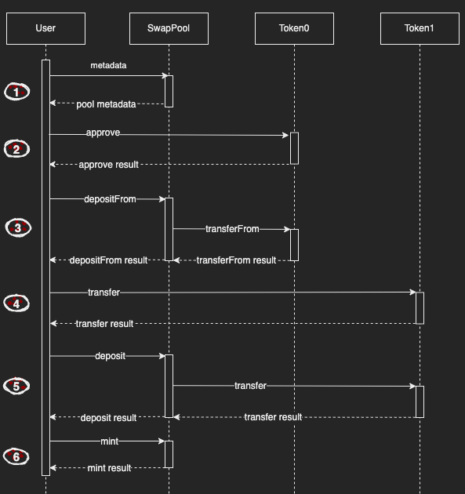
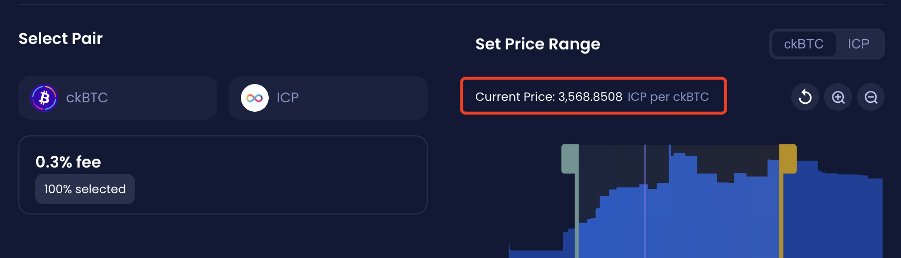
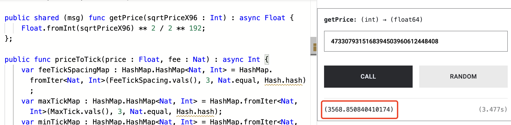
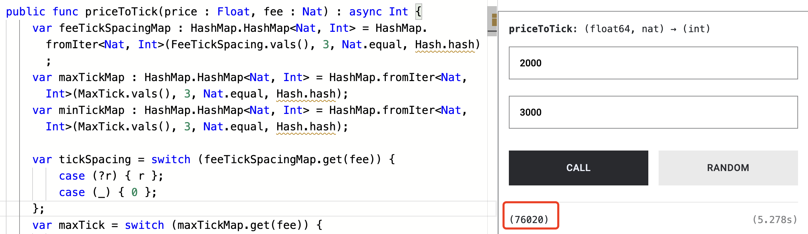
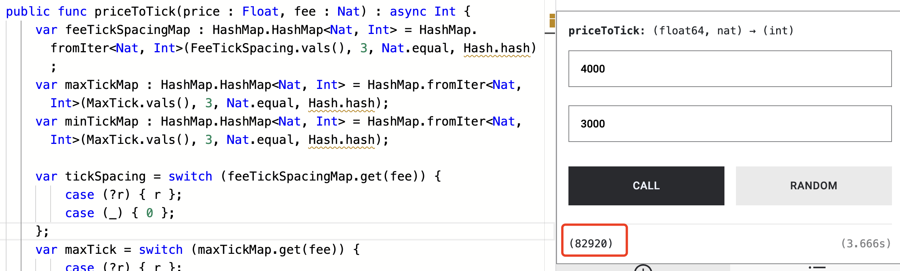
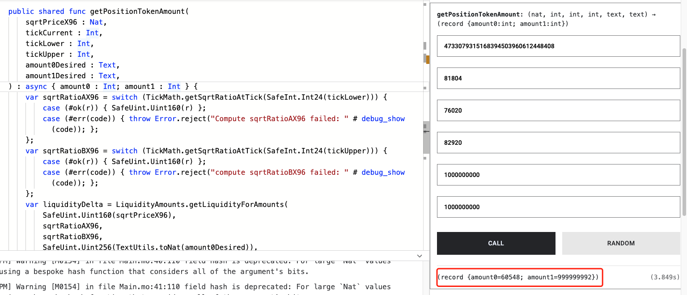

# Minting a Position

## Introduction

This guide will cover how to create (or mint) a liquidity position in ICPSwap. Before starting, try to get the id of ICP - ckBTC SwapPool canister by [Searching a Pool](../../01.SwapFactory/01.Searching_a_Pool.md). In the returned data, it can be determined what tokens token0 and token1 are in the current SwapPool.

For this guide, the following canister ids are used:
|Name|Principal|
|:-|:-:|
|SwapPool of ICP - ckBTC|xmiu5-jqaaa-aaaag-qbz7q-cai|
|ICP|ryjl3-tyaaa-aaaaa-aaaba-cai|
|ckBTC|mxzaz-hqaaa-aaaar-qaada-cai|
|SwapCalculator|phr2m-oyaaa-aaaag-qjuoq-cai|

## Detail

SwapPool Candid

```
type DepositArgs = record { fee : nat; token : text; amount :nat };

type Error = variant {
    CommonError;
    InternalError : text;
    UnsupportedToken : text;
    InsufficientFunds;
};   

type MintArgs = 
 record {
   amount0Desired: text;
   amount1Desired: text;
   fee: nat;
   tickLower: int;
   tickUpper: int;
   token0: text;
   token1: text;
 };

type WithdrawArgs = record { fee : nat; token : text; amount : nat };

type Result = variant { ok : nat; err : Error };

type Result_5 = 
 variant {
   err: Error;
   ok: PoolMetadata;
 };

type Result_7 = variant {
  ok : record { balance0 : nat; balance1 : nat };
  err : Error;
};

type Result_11 = variant { ok : vec nat; err : Error };

type SwapPool = service {
    deposit : (DepositArgs) -> (Result);
    depositFrom : (DepositArgs) -> (Result);
    getUserPositionIdsByPrincipal : (principal) -> (Result_11) query;
    getUserUnusedBalance : (principal) -> (Result_7) query;
    metadata: () -> (Result_5) query;
    mint: (MintArgs) -> (Result);
    withdraw : (WithdrawArgs) -> (Result);
}
service : SwapPool
```

## Workflow



### Step 1

Use the **metadata** method to get the pool's metadata for subsequent parameter calculations.

### Step 2 & Step 3

If the standard of input token is DIP20, EXT, ICP or ICRC2, follow these 2 steps to deposit.

Refer to the interfaces of the token itself, giving approval for particular SwapPool to transfer your tokens.

Then use **depositFrom** to transfer tokens from the caller to the SwapPool, and record the amount of token to the caller's account in current SwapPool.

In the input parameters:
+ *token* is the principal of token which will be deposited.
+ *amount* is the amount of deposited token multiplied by 10**decimals. For example, the decimals of ckBTC is 8, so input 11115 here means 0.00011115 ckBTC.
+ *fee* is the fee of deposited token. For example, the fee of ckBTC is 10.

In the output parameter, the result is the amount of deposited token multiplied by 10**decimals.

### Step 4 & Step 5

If the standard of input token is ICRC1, follow these 2 steps to deposit.

Refer to the interfaces of the token itself, transfer token to the subaccount of the operator's principal under the SwapPool.

For example, transfer 1 ICP to the subaccount under the SwapPool of ICP - ckBTC. The '$subaccount' in this command is the subaccount of the operator's principal.

```
dfx canister --network=ic call ryjl3-tyaaa-aaaaa-aaaba-cai icrc1_transfer '(record {from_subaccount = null; to = record {owner = principal "xmiu5-jqaaa-aaaag-qbz7q-cai"; subaccount = opt blob "$subaccount";}; amount = 100000000:nat; fee = opt 10000:nat; memo = null; created_at_time = null;})'
```

> A Motoko demo of how to get a subaccount
```
public func principalToBlob(p: Principal): Blob {
    var arr: [Nat8] = Blob.toArray(Principal.toBlob(p));
    var defaultArr: [var Nat8] = Array.init<Nat8>(32, 0);
    defaultArr[0] := Nat8.fromNat(arr.size());
    var ind: Nat = 0;
    while (ind < arr.size() and ind < 32) {
        defaultArr[ind + 1] := arr[ind];
        ind := ind + 1;
    };
    return Blob.fromArray(Array.freeze(defaultArr));
};
```

Use **deposit** to transfer token from the subaccount under the SwapPool to the SwapPool itself, and record the amount of token to the caller's account in current SwapPool.

In the input parameters:
+ *token* is the principal of token which will be deposited.
+ *amount* is the amount of deposited token multiplied by 10**decimals. For example, the decimals of ICP is 8, so input 100000000 here means 1 ICP.
+ *fee* is the fee of deposited token. For example, the fee of ICP is 10000.

In the output parameter, the result is the amount of deposited token multiplied by 10**decimals.

### Step 6

Based on the previously queried metadata and the amounts of tokens deposited into the SwapPool, use **mint** to mint a liquidity position.

In the input parameters:
+ *amount0Desired* is the amount of deposited token0 multiplied by 10**decimals. For example, token0 in this SwapPool is ckBTC, and the decimals of ckBTC is 8, so input 11115 here means 0.00011115 ckBTC.
+ *amount1Desired* is the amount of deposited token1 multiplied by 10**decimals. For example, token1 in this SwapPool is ICP, and the decimals of ICP is 8, so input 100000000 here means 1 ICP.
+ *fee* is the fee that is taken from every swap that is executed on the pool in 1 per million. You can use the value(fee) which gets from **metadata**.
+ *token0* is the canister principal id of the token0 in current SwapPool, you can use the value(token0.address) which gets from **metadata**.
+ *token1* is the canister principal id of the token1 in current SwapPool, you can use the value(token1.address) which gets from **metadata**.
+ *tickUpper* is the upper tick of this position, it can be computed to the upper price of the position.
+ *tickLower* is the lower tick of this position, it can be computed to the lower price of the position.

For specific calculations of the input parameters like amount0Desired, amount1Desired, tickLower and tickUpper, here's an online demo: https://m7sm4-2iaaa-aaaab-qabra-cai.raw.ic0.app/?tag=3360190326. Or you can use the SwapCalculator canister too.

First, deploy the Main.mo and use the **getPrice** method to get the current price by passing in *sqrtPriceX96* which gets from the **metadata**.





Second, choose the price range of the liquidity position you want to mint based on the current price. For example, 2000 to 4000. Then use the **priceToTick** method to calculate the tick numbers based on the price range. In this method, the second parameter is the *fee* of the SwapPool.





Third, use the **getPositionTokenAmount** method to compute the amount0Desired/amount1Desired value.

The reason this method passes in specific amount0Desired/amount1Desired values even though it's meant to calculate amount0Desired/amount1Desired is that, the method will recalculate the amount numbers to be added based on the smallest token amount which satisfies the liquidity to be added. 

All other input parameters are available in the previous steps. Then this method will return the amount0Desired and amount1Desired values.

