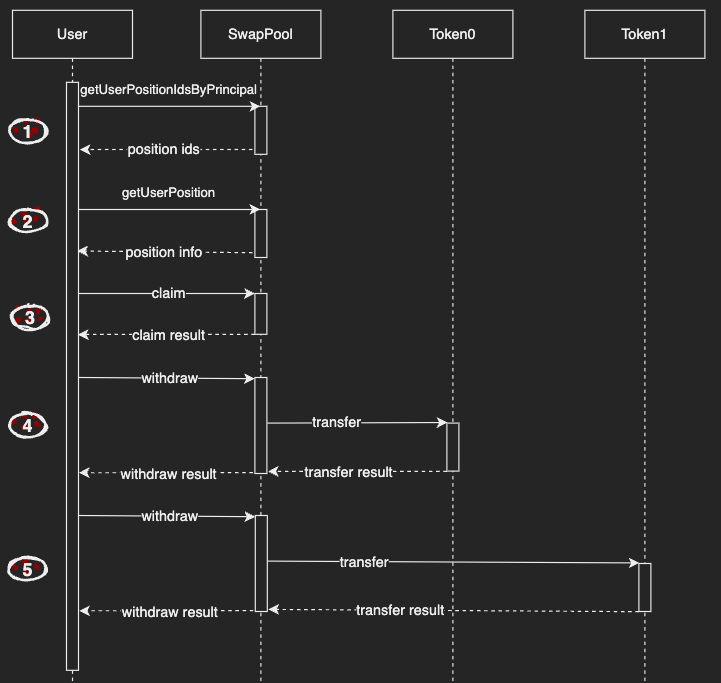

# Collecting Fees

## Introduction

This guide will cover how to collect fees from a liquidity position in ICPSwap. Before starting, try to get the id of ICP - ckBTC SwapPool canister by [Searching a Pool](../../01.SwapFactory/01.Searching_a_Pool.md). In the returned data, it can be determined what tokens token0 and token1 are in the current SwapPool.

For this guide, the following canister ids are used:
|Name|Principal|
|:-|:-:|
|SwapPool of ICP - ckBTC|xmiu5-jqaaa-aaaag-qbz7q-cai|
|ICP|ryjl3-tyaaa-aaaaa-aaaba-cai|
|ckBTC|mxzaz-hqaaa-aaaar-qaada-cai|

## Detail

SwapPool Candid

```
type ClaimArgs = record { positionId : nat };

type Error = variant {
    CommonError;
    InternalError : text;
    UnsupportedToken : text;
    InsufficientFunds;
};  

type UserPositionInfo = record {
  tickUpper : int;
  tokensOwed0 : nat;
  tokensOwed1 : nat;
  feeGrowthInside1LastX128 : nat;
  liquidity : nat;
  feeGrowthInside0LastX128 : nat;
  tickLower : int;
};

type WithdrawArgs = record { fee : nat; token : text; amount : nat };

type Result = variant { ok : nat; err : Error };

type Result_11 = variant { ok : vec nat; err : Error };

type Result_13 = variant { ok : UserPositionInfo; err : Error };

type Result_23 = variant {
  ok : record { amount0 : nat; amount1 : nat };
  err : Error;
};

type SwapPool = service {
    claim : (ClaimArgs) -> (Result_23);
    getUserPosition : (nat) -> (Result_13) query;
    getUserPositionIdsByPrincipal : (principal) -> (Result_11) query;
    withdraw : (WithdrawArgs) -> (Result);
}

service : SwapPool
```

## Workflow



### Step 1

Use the **getUserPositionIdsByPrincipal** method to get the position ids held by the user based on the user principal, and pick one of the ids for the collecting operation.

### Step 2

Using the position id obtained in the previous step, query the position details based on the id through the **getUserPosition** method.

In the output parameters:
+ *liquidity* is the amount of liquidity, it can be computed to the amounts of token0 and token1.
+ *tickUpper* is the upper tick of this position, it can be computed to the upper price of the position.
+ *tickLower* is the lower tick of this position, it can be computed to the lower price of the position.
+ *tokensOwed0* is the token0 fee earned by the position owner.
+ *tokensOwed1* is the token1 fee earned by the position owner.

### Step 3

Based on the position data queried in the previous step, we can use **claim** to collect fees from a liquidity position by passing a position id.

In the input parameters:
+ *positionId* is the position id which passed into **getUserPosition** in step 2.

In the output parameters:
+ *amount0* is the amount of token0 fee earned in this position, it will be deposited to the caller's account in current SwapPool.
+ *amount1* is the amount of token1 fee earned in this position, it will be deposited to the caller's account in current SwapPool.

If amount0 or amount1 is not zero, **claim** will automatically trigger two scheduled tasks to withdraw the corresponding amount of tokens for the user, without requiring a manual operation.

## Exception Handling

### withdraw failed

If the call to the token's transfer method fails, which may be caused by network latency or insufficient token canister cycle. At this time, you need to contact ICPSwap team, by calling **getTransactionsByOwner** method, compare the error log with the token transaction record, to determine whether the token has been transferred successfully. Then the ICPSwap administrator will use **deleteFailedTransaction** to delete the log.