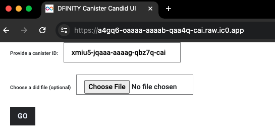
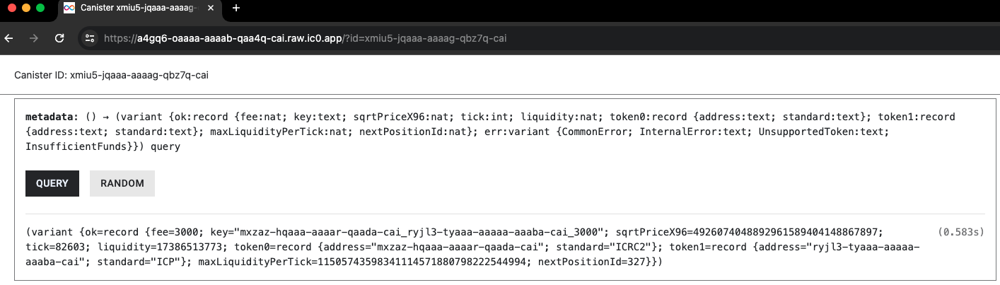
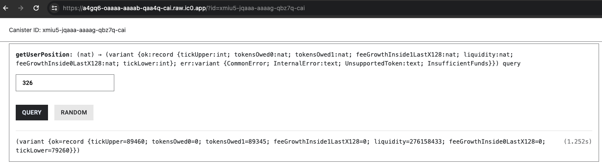
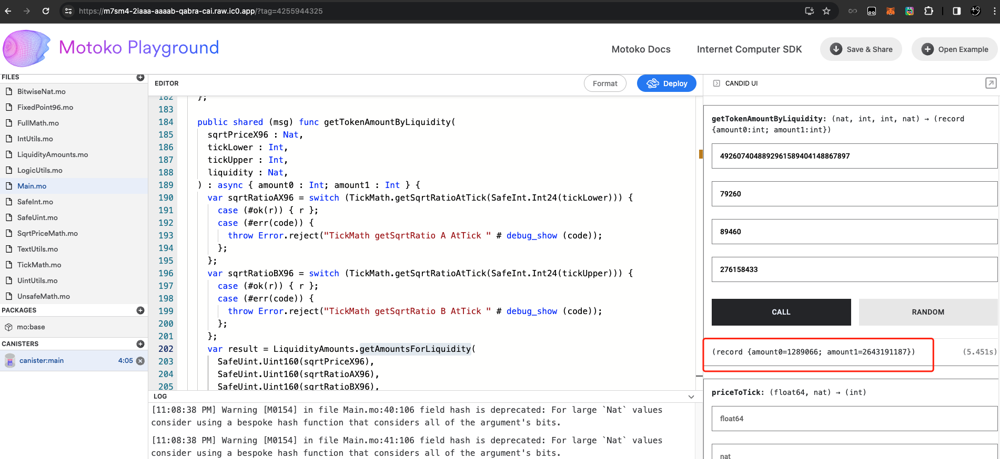
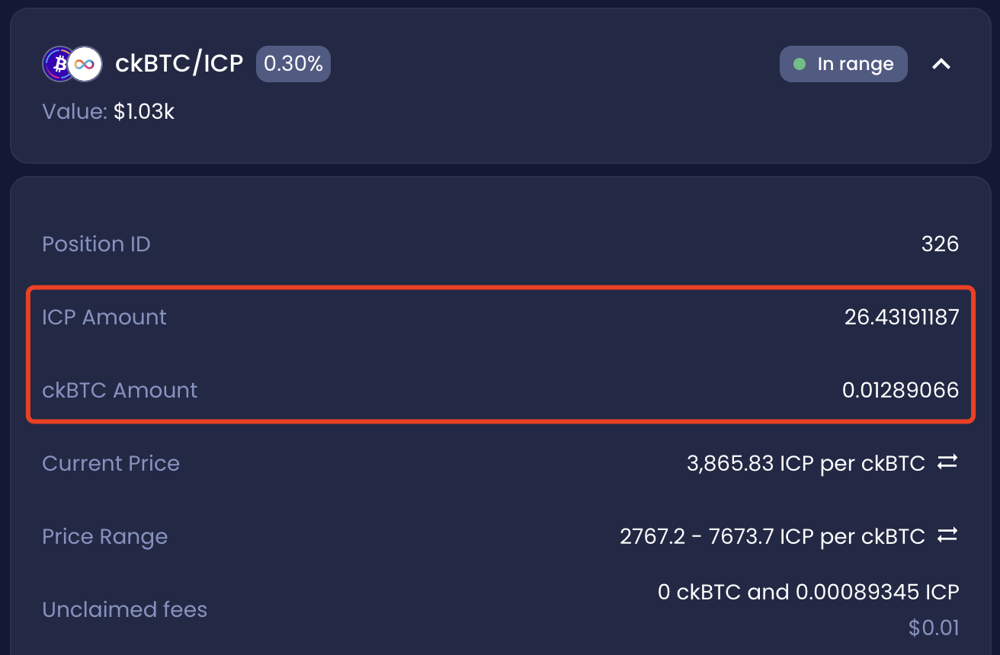

# Getting Amounts For Liquidity

## Introduction

This guide will cover how to get token amounts in a particular user position by liquidity number in ICPSwap. Before starting, try to get the id of ICP - ckBTC SwapPool canister by [Searching a Pool](../../01.SwapFactory/01.Searching_a_Pool.md). In the returned data, it can be determined what tokens token0 and token1 are in the current SwapPool.

For this guide, the following canister ids are used:
|Name|Principal|
|:-|:-:|
|SwapPool of ICP - ckBTC|xmiu5-jqaaa-aaaag-qbz7q-cai|

## Workflow

### Step 1
Open DFINITY Canister Candid UI: https://a4gq6-oaaaa-aaaab-qaa4q-cai.raw.ic0.app/.

Enter the canister id of ICP-ckBTC SwapPool and click 'GO'.

### Step 2
Query metadata to get *sqrtPriceX96*.

### Step 3
Query user position data by id to get *tickLower*, *tickUpper* and *liquidity*.

### Step 4
Open the link to the online tool: https://m7sm4-2iaaa-aaaab-qabra-cai.raw.ic0.app/?tag=4255944325.

Click the 'Deploy' button.

Find the **getTokenAmountByLiquidity** function and enter the corresponding parameters. Click 'CALL' and get the amounts of tokens multiplied by 10**decimals.

