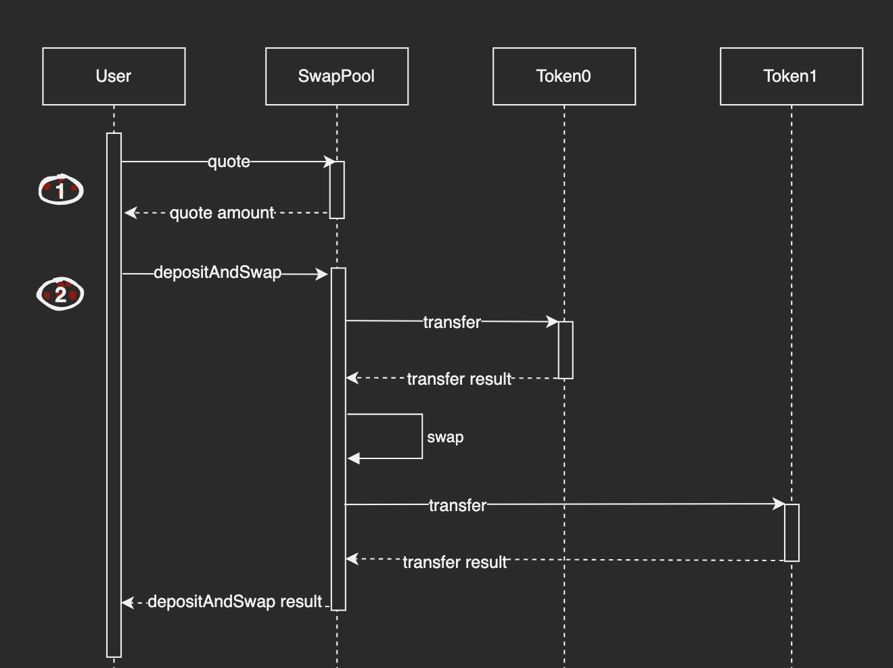

# Executing DepositAndSwap

## Introduction

This guide will build off our [quoting guide](./01.Getting_a_Quote.md) and show how to use a quote to construct and execute an one-step trade by **depositAndSwap** in ICPSwap. Before starting, try to get the id of ICP - ckBTC SwapPool canister by [Searching a Pool](../../01.SwapFactory/01.Searching_a_Pool.md). In the returned data, it can be determined what tokens token0 and token1 are in the current SwapPool.

For this guide, the following canister ids are used:
|Name|Principal|
|:-|:-:|
|SwapPool of ICP - ckBTC|xmiu5-jqaaa-aaaag-qbz7q-cai|
|ICP|ryjl3-tyaaa-aaaaa-aaaba-cai|
|ckBTC|mxzaz-hqaaa-aaaar-qaada-cai|

## Detail

SwapPool Candid

```
type DepositAndSwapArgs = record {
  amountIn : text;
  zeroForOne : bool;
  amountOutMinimum : text;
  tokenInFee : nat;
  tokenOutFee : nat;
};

type Error = variant {
   CommonError;
   InsufficientFunds;
   InternalError: text;
   UnsupportedToken: text;
 };

type Result = variant { ok : nat; err : Error };

type SwapPool = service {
    depositAndSwap : (DepositAndSwapArgs) -> (Result);
}

service : SwapPool
```

## Workflow

This workflow is applicable to the ICRC1 token standard.



### Step 1: Get a Quote

First, use the **quote** method to get an estimate of the output amount for your desired trade. This helps you understand the expected exchange rate and set appropriate slippage tolerance.

In the input parameters:
+ *zeroForOne* is the symbol for trading direction. If token0 swaps token1, then *true*, otherwise *false*.
+ *amountIn* is the amount of input token multiplied by 10**decimals. For example, the decimals of ICP is 8, so input 100000000 here means 1 ICP.
+ *amountOutMinimum* is not used in quote, can be set to "0".

In the output parameter, the result is the estimated amount of output token multiplied by 10**decimals.

### Step 2: Execute DepositAndSwap

Use **depositAndSwap** to execute an one-step trade between two tokens. This method combines deposit, swap and withdraw operations into a single transaction, making it more efficient than separate deposit, swap and withdraw calls.

In the input parameters:
+ *zeroForOne* is the symbol for trading direction. If token0 swaps token1, then *true*, otherwise *false*.
+ *tokenInFee* is the fee of input token. For example, the fee of ICP is 10000.
+ *tokenOutFee* is the fee of output token. For example, the fee of ckBTC is 10.
+ *amountIn* is the amount of input token multiplied by 10**decimals. For example, the decimals of ICP is 8, so input 100000000 here means 1 ICP.
+ *amountOutMinimum* is the expected minimum amount of output token, used as a slippage tolerance restriction. Callers can set this number by themselves based on the result of **quote**. For example, if you can accept a 15% slippage tolerance, you can just input the amount of *(quote_result * 85%)*. If slippage is over range, the input token will be refunded to your account automatically.

In the output parameter, the result is the amount of output token multiplied by 10**decimals.

## Exception Handling

During the execution of a transaction, certain steps may fail. We can handle the failure situations by the following methods.

### Deposit Failed

The deposit step can fail in two ways:

1. If the token transfer fails (e.g., insufficient balance, network issues), no action is needed as the tokens remain in the user's account.

2. If the token transfer succeeds but the deposit record fails (e.g., due to network issues), the tokens will be temporarily held in SwapPool. In this case, users need to contact the ICPSwap team. The administrator will verify the transaction and process the refund through the backend system.

### Withdraw Failed

The withdraw step can fail in two ways:

1. If the token transfer succeeds, no action is needed as the tokens have been successfully transferred to the user.

2. If the token transfer fails (e.g., due to network latency or insufficient token canister cycles), users need to contact the ICPSwap team. The administrator will verify the transaction and process the refund through the backend system.