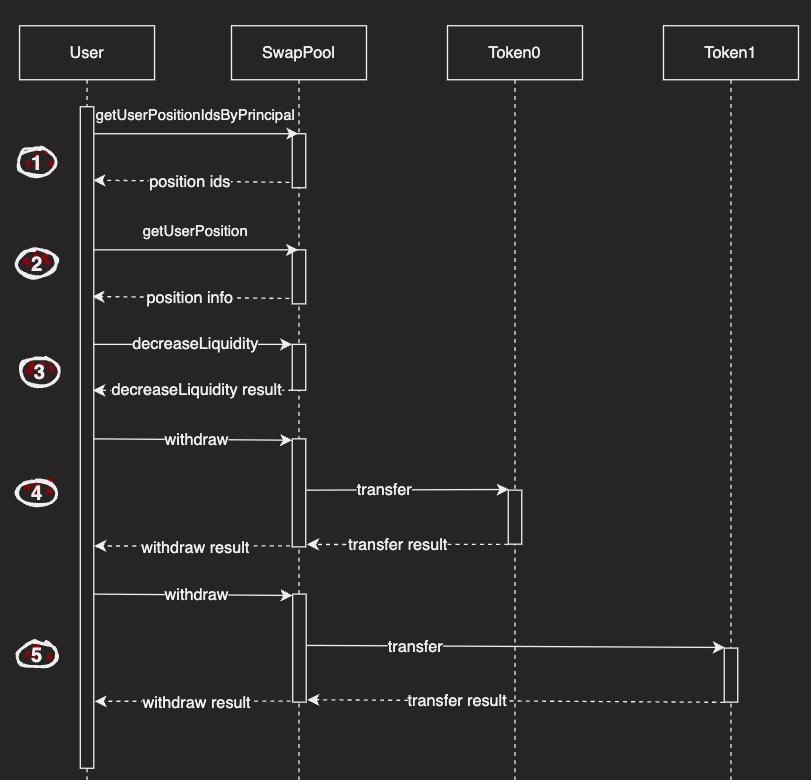

# Removing Liquidity

## Introduction

This guide will cover how to modify a liquidity position by removing liquidity in ICPSwap. Before starting, try to get the id of ICP - ckBTC SwapPool canister by [Searching a Pool](../../SwapFactory/01.Searching_a_Pool.md). In the returned data, it can be determined what tokens token0 and token1 are in the current SwapPool.

For this guide, the following canister ids are used:
|Name|Principal|
|:-|:-:|
|SwapPool of ICP - ckBTC|xmiu5-jqaaa-aaaag-qbz7q-cai|
|ICP|ryjl3-tyaaa-aaaaa-aaaba-cai|
|ckBTC|mxzaz-hqaaa-aaaar-qaada-cai|

## Detail

SwapPool Candid

```
type DecreaseLiquidityArgs = record { liquidity : text; positionId : nat };

type Error = variant {
    CommonError;
    InternalError : text;
    UnsupportedToken : text;
    InsufficientFunds;
};  

type UserPositionInfo = record {
  tickUpper : int;
  tokensOwed0 : nat;
  tokensOwed1 : nat;
  feeGrowthInside1LastX128 : nat;
  liquidity : nat;
  feeGrowthInside0LastX128 : nat;
  tickLower : int;
};

type WithdrawArgs = record { fee : nat; token : text; amount : nat };

type Result = variant { ok : nat; err : Error };

type Result_11 = variant { ok : vec nat; err : Error };

type Result_13 = variant { ok : UserPositionInfo; err : Error };

type Result_23 = variant {
  ok : record { amount0 : nat; amount1 : nat };
  err : Error;
};

type SwapPool = service {
    decreaseLiquidity : (DecreaseLiquidityArgs) -> (Result_23);
    getUserPosition : (nat) -> (Result_13) query;
    getUserPositionIdsByPrincipal : (principal) -> (Result_11) query;
    withdraw : (WithdrawArgs) -> (Result);
}

service : SwapPool
```

## Workflow



### Step 1

Use the **getUserPositionIdsByPrincipal** method to get the position ids held by the user based on the user principal, and pick one of the ids for the liquidity decreasing operation.

### Step 2

Using the position id obtained in the previous step, query the position details based on the id through the **getUserPosition** method.

In the output parameters:
+ *liquidity* is the amount of liquidity, it can be computed to the amounts of token0 and token1.
+ *tickUpper* is the upper tick of this position, it can be computed to the upper price of the position.
+ *tickLower* is the lower tick of this position, it can be computed to the lower price of the position.
+ *tokensOwed0* is the token0 fee earned by the position owner.
+ *tokensOwed1* is the token1 fee earned by the position owner.

### Step 3

Based on the position data queried in the previous step, we can use **decreaseLiquidity** to extract corresponding token amounts by passing a liquidity quantity.

In the input parameters:
+ *liquidity* is the quantity of liquidity, it must be less than or equal to the liquidity quantity which queried in step 2。
+ *positionId* is the position id which passed into **getUserPosition** in step 2.

In the output parameters:
+ *amount0* is the amount of token0 which is computed by liquidity quantity, it will be deposited to the caller's account in current SwapPool.
+ *amount1* is the amount of token1 which is computed by liquidity quantity, it will be deposited to the caller's account in current SwapPool.

### Step 4 & Step 5

Use **withdraw** to extract the tokens obtained from the previous step.

In the input parameters:
+ *token* is the principal of token which will be withdrawed.
+ *amount* is the amount of withdrawed token multiplied by 10**decimals. For example, the decimals of ckBTC is 8, so input 11115 here means 0.00011115 ckBTC.
+ *fee* is the fee of withdrawed token. For example, the fee of ckBTC is 10.