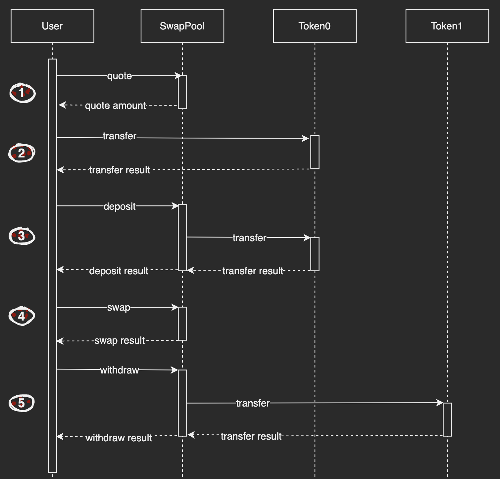
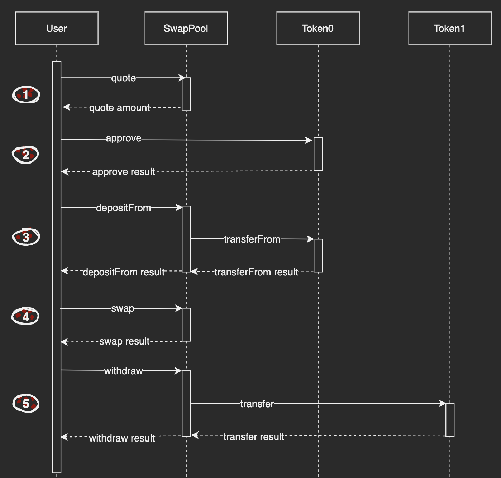

# Executing a Trade

## Introduction

This guide will build off our [quoting guide](./01.Getting_a_Quote.md) and show how to use a quote to construct and execute a trade in ICPSwap. Before starting, try to get the id of ICP - ckBTC SwapPool canister by [Searching a Pool](../../SwapFactory/01.Searching_a_Pool.md). In the returned data, it can be determined what tokens token0 and token1 are in the current SwapPool.

In this example we will use **swap** to trade between two tokens: ICP and ckBTC. The inputs are the *zeroForOne* symbol, the *amountIn* and the *amountOutMinimum*.

For this guide, the following canister ids are used:
|Name|Principal|
|:-|:-:|
|SwapPool of ICP - ckBTC|xmiu5-jqaaa-aaaag-qbz7q-cai|
|ICP|ryjl3-tyaaa-aaaaa-aaaba-cai|
|ckBTC|mxzaz-hqaaa-aaaar-qaada-cai|

## Detail

SwapPool Candid

```
type DepositArgs = record { fee : nat; token : text; amount : nat };

type SwapArgs = record {
  amountIn : text;
  zeroForOne : bool;
  amountOutMinimum : text;
};

type WithdrawArgs = record { fee : nat; token : text; amount : nat };

type Error = variant {
   CommonError;
   InsufficientFunds;
   InternalError: text;
   UnsupportedToken: text;
 };

type Result = variant { ok : nat; err : Error };

type Result_7 = variant {
  ok : record { balance0 : nat; balance1 : nat };
  err : Error;
};

type SwapPool = service {
    deposit : (DepositArgs) -> (Result);
    depositFrom : (DepositArgs) -> (Result);
    getUserUnusedBalance : (principal) -> (Result_7) query;
    quote : (SwapArgs) -> (Result) query;
    swap : (SwapArgs) -> (Result);
    withdraw : (WithdrawArgs) -> (Result);
}

service : SwapPool

```


## Workflow

### Workflow 1

If the standard of input token is ICRC1 or ICP, follow this workflow.


#### Step 1

Refer to the [quoting guide](./01.Getting_a_Quote.md).

#### Step 2

Refer to the interfaces of the token itself, transfer token to the subaccount of the operator's principal under the SwapPool.

For example, transfer 1 ICP to the subaccount under the SwapPool of ICP - ckBTC. The '$subaccount' in this command is the subaccount of the operator's principal.

```
dfx canister --network=ic call ryjl3-tyaaa-aaaaa-aaaba-cai icrc1_transfer '(record {from_subaccount = null; to = record {owner = principal "xmiu5-jqaaa-aaaag-qbz7q-cai"; subaccount = opt blob "$subaccount";}; amount = 100000000:nat; fee = opt 10000:nat; memo = null; created_at_time = null;})'
```

> A Motoko demo of how to get a subaccount
```
public func principalToBlob(p: Principal): Blob {
    var arr: [Nat8] = Blob.toArray(Principal.toBlob(p));
    var defaultArr: [var Nat8] = Array.init<Nat8>(32, 0);
    defaultArr[0] := Nat8.fromNat(arr.size());
    var ind: Nat = 0;
    while (ind < arr.size() and ind < 32) {
        defaultArr[ind + 1] := arr[ind];
        ind := ind + 1;
    };
    return Blob.fromArray(Array.freeze(defaultArr));
};
```

#### Step 3

Use **deposit** to transfer token from the subaccount under the SwapPool to the SwapPool itself, and record the amount of token to the caller's account in current SwapPool.

In the input parameters:
+ *token* is the principal of token which will be deposited.
+ *amount* is the amount of deposited token multiplied by 10**decimals. For example, the decimals of ICP is 8, so input 100000000 here means 1 ICP.
+ *fee* is the fee of deposited token. For example, the fee of ICP is 10000.

In the output parameter, the result is the amount of deposited token multiplied by 10**decimals.

#### Step 4

Use **swap** to trade between two tokens. But the output token will not be transferred to the caller directly, it will be deposited to the caller's account in current SwapPool.

In the input parameters:
+ *zeroForOne* is the symbol for trading direction. If token0 swaps token1, then *true*, otherwise *false*.
+ *amountIn* is the amount of input token multiplied by 10**decimals. For example, the decimals of ICP is 8, so input 100000000 here means 1 ICP.
+ *amountOutMinimum* is the expected minimum amount of output token, used as an slippage tolerance restriction. Callers can set this number by themselves based on the result of **quote**. For example, if you can accept a 15% slippage tolerance, you can just input the amount of *(quote_result * 85%)*. If slippage is over range, the input token will be deposited to your account in current SwapPool again, and you can withdraw them by interface or UI.

In the output parameter, the result is the amount of output token multiplied by 10**decimals.

#### Step 5

Use **withdraw** to extract the tokens obtained from the previous swap.

In the input parameters:
+ *token* is the principal of token which will be withdrawed.
+ *amount* is the amount of withdrawed token multiplied by 10**decimals. For example, the decimals of ckBTC is 8, so input 11115 here means 0.00011115 ckBTC.
+ *fee* is the fee of withdrawed token. For example, the fee of ckBTC is 10.

### Workflow 2

If the standard of input token is DIP20, EXT, ICP or ICRC2, follow this workflow.


#### Step 1

Refer to the [quoting guide](./01.Getting_a_Quote.md).

#### Step 2

Refer to the interfaces of the token itself, giving approval for particular SwapPool to transfer your tokens.

#### Step 3

Use **depositFrom** to transfer tokens from the caller to the SwapPool, and record the amount of token to the caller's account in current SwapPool.

In the input parameters:
+ *token* is the principal of token which will be deposited.
+ *amount* is the amount of deposited token multiplied by 10**decimals. For example, the decimals of ckBTC is 8, so input 11115 here means 0.00011115 ckBTC.
+ *fee* is the fee of deposited token. For example, the fee of ckBTC is 10.

In the output parameter, the result is the amount of deposited token multiplied by 10**decimals.

#### Step 4

Use **swap** to trade between two tokens. But the output tokens will not be transferred to the caller directly, it will be deposited to the caller's account in current SwapPool.

In the input parameters:
+ *zeroForOne* is the symbol for trading direction. If token0 swaps token1, then *true*, otherwise *false*.
+ *amountIn* is the amount of input token multiplied by 10**decimals. For example, the decimals of ckBTC is 8, so input 11115 here means 0.00011115 ckBTC.
+ *amountOutMinimum* is the expected minimum amount of output token, used as an slippage tolerance restriction. Callers can set this number by themselves based on the result of **quote**. For example, if you can accept a 15% slippage tolerance, you can just input the amount of *(quote_result * 85%)*. If slippage is over range, the input token will be deposited to your account in current SwapPool again, and you can withdraw them by interface or UI.

In the output parameter, the result is the amount of output token multiplied by 10**decimals.

#### Step 5

Use **withdraw** to extract the tokens obtained from the previous swap.

In the input parameters:
+ *token* is the principal of token which will be withdrawed.
+ *amount* is the amount of withdrawed token multiplied by 10**decimals. For example, the decimals of ICP is 8, so input 100000000 here means 1 ICP.
+ *fee* is the fee of withdrawed token. For example, the fee of ICP is 10000.

## Exception Handling

During the execution of a transaction, certain steps may fail. We can handle the failure situation by the following methods.

### deposit failed

Before the **deposit** method is called, the user's token is transferred under their sub-account in the SwapPool. If the **deposit** method call fails, you can try to re-call **deposit**. Then proceed to the next step in the trading, or you can also use the **withdraw** method to extract the tokens that were deposited in.

### swap failed

If the swap method call fails, the deposited token balance will still be recorded in that user's account in SwapPool. In this case, the user can use the **withdraw** method to extract the token, or adjust the *amountOutMinimum* parameter in the **swap** method and call the **swap** method again.

### withdraw failed

**withdraw** fails in two ways.

The first is when the call to the token's transfer method succeeds, but the transfer results in a failure. At this time, the user's token is still recorded in his account in the SwapPool, which can be queried through the **getUserUnusedBalance** method, with the parameter passed in as the user principal.

The second is that the call to the token's transfer method fails, which may be caused by network latency or insufficient token canister cycle. At this time, you need to contact ICPSwap team, by calling **getWithdrawErrorLog** method, compare the error log with the token transaction record, to determine whether the token has been transferred successfully. Then the ICPSwap administrator will use **removeWithdrawErrorLog** to delete the log.